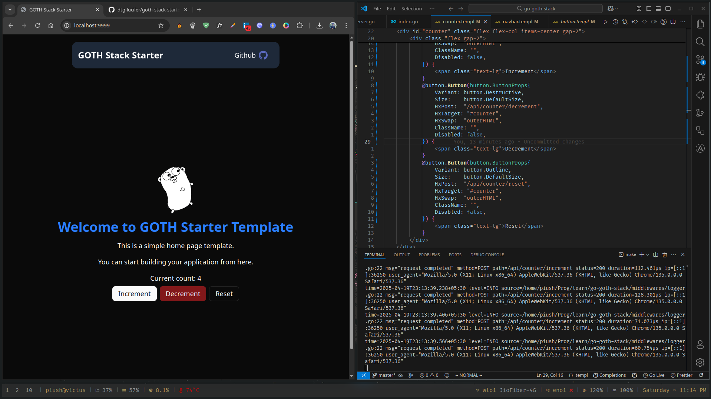

# GOTTH Stack Starter Template (Full fledged production ready template)

A production-ready, fully-featured starter template for building modern web applications using the GOTH stack:
- Simple and global state management on the server side (no need for use of Redux or similar libraries)
- Compiled in to single binary to ship to production (including your static assets)
- Type-safe HTML templating with Templ
- Fast and efficient server-side rendering with Go



- **GO** - A fast, statically typed programming language
- **T**empl - Typed HTML templating for Go
- **T**ailwindCSS - A utility-first CSS framework for rapid UI development
- **H**TMX - HTML-based AJAX for dynamic interfaces without writing JavaScript
- **Alpine.js** - Special sauce, Specialized for HTMX, a minimal JavaScript framework for adding interactivity to HTML

## 🚀 Key Benefits

- **Production Ready**: Built for real-world applications with performance in mind
- **Single Binary Deployment**: Package your entire application into one executable file
- **Zero JavaScript Required**: Create dynamic interfaces with HTMX without writing JS
- **Type-Safe Templates**: Catch errors at compile time, not in production
- **Rapid Development**: Hot-reloading development environment with simple commands

## ✨ Features

- ✅ Fast and light Go-based server with production-grade performance
- ✅ Chi router with middleware support for flexible routing
- ✅ Templ for type-safe HTML templating with compile-time checks
- ✅ HTMX for interactive UI without JavaScript complexity
- ✅ Alpine.js for lightweight reactivity and client-side interactions
- ✅ JavaScript bundling with esbuild for organizing client-side code
- ✅ Browser-sync for automatic browser refreshing during development
- ✅ Environment variable configuration with .env support
- ✅ Development mode with hot-reloading
- ✅ Production mode with embedded assets in a single binary
- ✅ Error handling middleware
- ✅ Tailwind CSS integration for modern styling
- ✅ Simple Makefile-based setup and build process

## 📁 Project Structure

```
.
├── components/      # Reusable UI components
├── handlers/        # HTTP request handlers
├── middlewares/     # Custom middleware functions
├── public/          # Static assets (CSS, JS, images)
├── scripts/         # JavaScript files to be bundled
├── utils/           # Utility functions
├── views/           # Templ templates
│   ├── home/        # Home page templates
│   └── layout/      # Layout templates
├── bin/             # Compiled binaries and tools
├── main.go          # Application entry point
├── server.go        # Server configuration
├── static_dev.go    # Static file handling for development
├── static_prod.go   # Static file handling for production
├── Makefile         # Build and development commands
└── go.mod           # Go module definition
```

## 🛠 How It Works

### Server Setup (main.go)

The main.go file initializes the server:
- Loads environment variables
- Sets up the Chi router
- Configures static file serving
- Registers HTTP routes
- Starts the HTTP server

### Templating (views/)

The application uses Templ for rendering HTML:
- Layout templates provide the common structure
- Content templates define page-specific content
- Templates are type-safe and compiled to Go code

### Static Files

The application handles static files differently based on the build mode:
- In development (`static_dev.go`): Serves files directly from the filesystem
- In production (`static_prod.go`): Serves files embedded in the binary

### Handlers

Handlers process HTTP requests and return responses:
- Uses Chi router for routing
- Middleware for common functionality (error handling, etc.)
- Renders HTML using Templ templates

### Frontend

The frontend utilizes:
- HTMX for dynamic content without writing JavaScript
- Alpine.js for adding lightweight reactivity and client-side behavior
- JavaScript bundling for organizing client-side code
- CSS for styling (Tailwind CSS is integrated)

All JavaScript files placed in the `scripts/` directory are automatically bundled, minified, and output to `public/script.js` when building or running the application.

## 🚀 Getting Started

### Prerequisites

- Go 1.20 or later
- That's it! The setup process will automatically download other dependencies.

### Quick Setup (2 minutes)

1. Clone the repository
   ```
   git clone https://github.com/yourusername/goth-stack-starter.git
   cd goth-stack-starter
   ```

2. Run the setup command (downloads all dependencies and sets up the environment)
   ```
   make setup
   ```

3. Start the development server with hot reloading
   ```
   make dev
   ```

4. Or build and run for production
   ```
   make run
   ```

5. Visit `http://localhost:3000` in your browser for development (browser-sync automatically opens this for you)
   Visit `http://localhost:9999` for production

### Development Workflow

The development mode includes:
- Automatic rebuilding of Go code on save
- Templ templates hot reloading
- Tailwind CSS rebuilding on changes
- Browser-sync for automatic page refreshing
- Everything runs with a single command: `make dev`

### Production Deployment

For production, simply run:
```
make run
```

This will:
1. Compile your Templ templates
2. Build your Tailwind CSS
3. Embed all static assets into the binary
4. Build a single executable file
5. Run your application

Deploy by copying just the binary file to your server!

### Using HTMX

HTMX is already included in the layout. Create dynamic interfaces without writing JavaScript:

```html
<button hx-post="/api/example" hx-swap="outerHTML">
  Click Me
</button>
```

### Using Alpine.js

Alpine.js is included for lightweight reactivity and DOM manipulation:

```html
<div x-data="{ open: false }">
  <button @click="open = !open">Toggle</button>
  <div x-show="open">Content</div>
</div>
```

**Important Note**: The order of script tags in the `root.templ` file must not be modified. Alpine.js must be loaded before your content, and the script order is crucial for proper functioning.

## 📚 Documentation

The GOTH stack provides a simple, powerful approach to web development:

- **Go** handles routing, business logic, and server-side operations
- **Organized Structure** keeps your codebase maintainable as it grows
- **Templ** provides type-safe HTML templates that compile to Go code
- **HTMX** allows for dynamic interfaces with minimal front-end code
- **Alpine.js** provides lightweight reactivity without complex JavaScript frameworks
- **JavaScript Bundling** organizes client-side code efficiently

## 🤝 Contributing

Contributions are welcome! Please feel free to submit a Pull Request.

## 📄 License

This project is licensed under the MIT License - see the LICENSE file for details.
